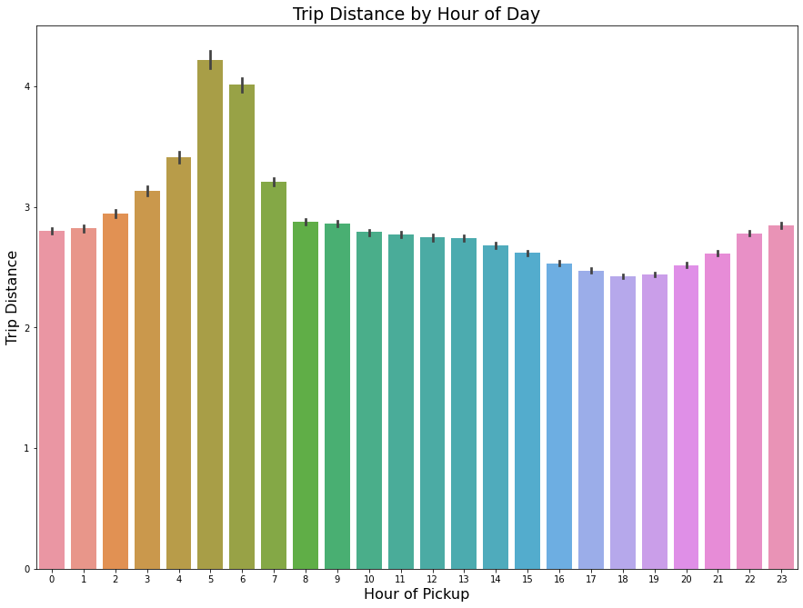

# Taxi and Limousine Comission (TLC) Green Cab Data

## Introduction

I provide analysis on taxi and limousine pickup/dropoff data provided to the Taxi and Limousine Corporation (TLC), and try to do the following:

- Report the number of rows and columns that loaded in the dataset
- Visualize trip distance by time of day and report any observations
- Identify the most popular pickup locations on weekends vs weekdays
- Build a model to forecast the number of trips by hour for the next 12 hours after Feb 12th 10:00 am, and evaluate the model's performance

## Contents of Submission Folder

| Filename | Description |
| :--- | :--- |
| `README.md` | Readme file. |
| | Contains the description found at the top of my notebook|
| `green_tripdata_2016-02.csv` | Dataset used in my analysis. |
| `tlc_green_cab_analysis.ipynb` | IPython notebook containing my code, |
| | and other details that allowed me to arrive at the conclusions below |
|`tlc_green_cab_analysis.html`| Same content as the notebook, but in HTML format.|
| | You can view this in your browser without having to install anything.|
| `trip_distance_vs_hour_of_day.png`| The graph used in this README folder. You may want to view this document in 'light-mode' so the axes can be seen. |

## Data Source & Tooling

The data used was obtained from [NYC Taxi and Limousine Commission Website](https://www1.nyc.gov/site/tlc/about/tlc-trip-record-data.page), specifically, the Green Taxi trip records from February 2016.

I used the following python tools:

- Numpy
- Pandas
- Matplotlib's pyplot library
- Seaborn

For the final problem of creating a forecasting model, I used the `statsmodels` module, specifically, the ARIMA, ACF, PACF, and Augmented Dickey-Fuller (ADF) functions/classes. To evaluate the model, I used the R^2-score and mean squared error found in the `sklearn.metrics` module.

## Summary of Results

The exact details of how I obtained the following results can be found in the rest of the notebook. However, here are my answers to the questions that were posed:

---

### Report the number of rows and columns that loaded in the dataset

---

There was 1,510,722 rows, and 21 columns loaded in the original dataset. I ended up dropping 2 rows that appeared to be erroneous, and 1 column that was entirely `NaN`.

---

### Visualize trip distance by time of day and report any observations

---

In visualizing the distance traveled at each pickup hour of the day (0 - 23), pickups that occur between 3am and 7am seem to have the highest trip distance, with the peak distance traveled occuring at 5am.

---

### Identify the most popular pickup locations on weekends vs weekdays

---

To identify the most popular pickup locations, I used `seaborn`'s `distplot` and `jointplot` functions to construct the distribution of the pickup latitude and longitude on weekends vs. weekdays. I read off the summary statistics to find the exact coordinate where the peak occured.

On weekends, the most popular pickup locations appear to be centered around the coordinates `(40.680267,-73.834705)`- close to the corner of 107th Ave and 105th St. On weekdays, this center moves a few blocks down to the coordinates `(40.67670,-73.81199)` - the corner of 116th Ave and 126th St.

---

### Build a model to forecast the number of trips by hour for the next 12 hours after Feb 12th 10:00 am, and evaluate the model's performance

---

I obtained the hourly pickup demand using pandas' `resample` function to obtain a count at each hour. One assumption for the ARIMA model is that data is [stationary](https://en.wikipedia.org/wiki/Stationary_process#Strict-sense_stationarity). I used the Augmented Dickey-Fuller test (`adfuller` in the `statsmodels.tsa.stattools` module) to test for stationarity. This test showed that while the raw count per hour data was unlikely to be sationary, it is safe at `95%` confidence to conclude that the first differenced and percentage change from previous were stationary.

In addition to observing trend and seasonality of a time series, the ACF and PACF plots provide a visual guide for what value of `p` in the `ARIMA(p,d,q)` model to use. In our case, `p=2` seemed to be a good choice. After fitting an `ARIMA(2,0,0)` model to the first differenced and percentage change data, their R^2 scores were compared. The first differenced data had a negative R^2 score which means that the `ARIMA(2,0,0)` model performs worse than just using the horizontal line, `y=mean`, to make predictions. The model performed much better on the percentage change data having an R^2 score of about `15%`.
